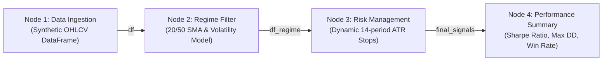

# ⬡ GraphBook (DAG Python Execution Canvas)

<p align="center">
  <strong>A visual Directed Acyclic Graph (DAG) alternative to linear Jupyter Notebooks.</strong><br>
  Position Python code blocks freely on a 2D canvas, route data dependencies across explicit handles, and execute with zero-mutation isolated namespaces and real-time WebSocket telemetry.
</p>

<p align="center">
  
  
  
  
  
  
</p>

---

## ✨ Features

- 🗺️ **Interactive 2D Infinite Canvas**: Pan, zoom, drag, and organize non-linear code blocks powered by `@xyflow/react`.
- ⚡ **Strict DAG Validation & Cycle Prevention**: Immediate feedback preventing circular dependencies using NetworkX topological sorting.
- 🛡️ **Namespace Isolation & Zero Mutation**:
  - Each node executes within an isolated local execution scope.
  - Intermediate variables (Pandas DataFrames, NumPy arrays, dictionaries) pass with defensive copying (`copy.deepcopy` & PyArrow) to ensure downstream mutations never alter upstream states.
- 🔌 **4-Port Connecting System**:
  - Top, Bottom, Left, and Right connection points on each box.
  - Connectors stay unobtrusive and dynamically glow when hovering or dragging a dependency line.
  - Interactive click-to-delete (<kbd>×</kbd>) on connecting lines and keyboard <kbd>Del</kbd> / <kbd>Backspace</kbd> support.
- 💻 **Embedded Monaco Editor**: Full VS Code editor inside each node with Python syntax highlighting, autocomplete, and indentation.
- 🔍 **Click-to-Maximize Focus Mode**:
  - Expand any node into a full-screen split workspace (<kbd>⌘+Enter</kbd> to run).
  - High-res code editor on the left and full tabular data inspector on the right.
- 📊 **Rich Multi-Tab Output Terminal**:
  - **Console**: Live streamed `stdout`, `stderr`, and formatted execution tracebacks.
  - **Data Table**: Paginated, formatted interactive table rendering for Pandas DataFrames and Series.
  - **Variables**: Dynamic type inspection, shape metadata, and memory metrics.
- 🚀 **One-Click Standalone Python Export**: Compiles the visual DAG into a clean, modular `.py` script ready for command-line execution or backtesting pipelines.
- 📡 **Real-Time Streaming Telemetry**: Bidirectional WebSocket connection (`/ws/execute`) streaming node statuses (`Queued` $\rightarrow$ `Running` $\rightarrow$ `Success`/`Error`), millisecond timers, and execution outputs.

---

## 🏗️ Tech Stack

| Layer | Technologies |
|---|---|
| **Frontend** | React 18, TypeScript, Vite, `@xyflow/react`, `@monaco-editor/react`, Tailwind CSS, Zustand, Lucide Icons |
| **Backend** | Python 3.10+, FastAPI, Uvicorn, WebSockets, NetworkX, Pandas, NumPy, PyArrow, Pytest |

---

## 🚀 Quickstart

### 1. Start Backend Server

```bash
cd backend
python3 -m venv venv
source venv/bin/activate  # On Windows: venv\Scripts\activate
pip install -r requirements.txt
python main.py
```

*The FastAPI WebSocket server starts at `http://127.0.0.1:8000` (Health: `/api/health`, WS: `/ws/execute`).*

### 2. Start Frontend App

In a separate terminal window:

```bash
cd ../frontend
npm install
npm run dev
```

*Open your browser and navigate to **`http://localhost:5173`**.*

---

## 🧪 Running Automated Tests

Run backend unit tests for sandbox isolation, immutability, DAG sorting, and standalone compiler:

```bash
cd backend
pytest test_backend.py -v
```

---

## 📈 Default Seed Pipeline (Quant Backtest Demo)

Upon initial launch, GraphBook auto-populates with a complete 4-stage Quantitative Trading Pipeline:



---

## ⌨️ Keyboard Shortcuts & Canvas Controls

| Action | Shortcut / Control |
|---|---|
| **Run Entire DAG** | Click **"Run Entire DAG"** in Top Bar |
| **Run Single Node** | Click **Play (▶)** on Node Header or press <kbd>⌘+Enter</kbd> in Focus Mode |
| **Maximize Node (Focus Mode)** | Click **Maximize (<kbd>⛶</kbd>)** on Node Header |
| **Exit Focus Mode** | Press <kbd>Escape</kbd> or click **"Minimize"** |
| **Delete Connection Line** | Click the <kbd>×</kbd> button on the line or press <kbd>Backspace</kbd> / <kbd>Delete</kbd> |
| **Pan Canvas** | Click & Drag empty canvas space |
| **Zoom In / Out** | Mouse Wheel / Trackpad Pinch |
| **Rename Node** | Double click Node Title |

---

## 📄 License

This project is licensed under the **MIT License** - see the [LICENSE](LICENSE) file for details.
